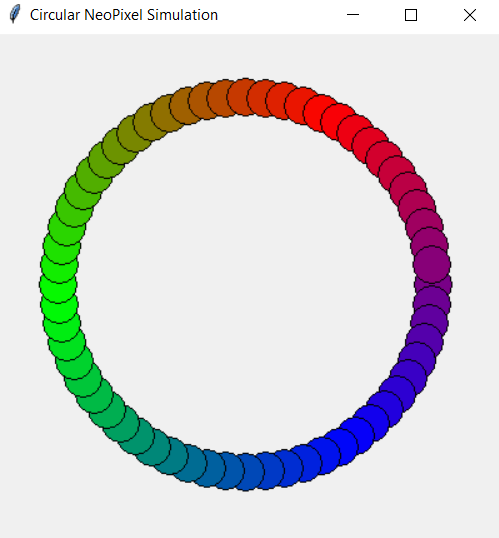

## Simulation testing (computer)

The stub file `machine.py` and `neopixel.py` are a tkinter simulation of the microcontroller and neopixel.

```
git clone https://github.com/PascalNoisette/micropython-neopixel.git
python .\test.py
```




## Hardware installation (microcontroller)


* You will need micropython https://micropython.org/download/ESP32_GENERIC_C3/ setup.

You must also install the microdot library. I suggest using the following package.

```
import mip
mip.install("github:brainelectronics/micropython-esp-wifi-manager")
```


* The animation is lightweight so it can run alongside other programs such as the wifi-manager and web_repl. See the [example boot file](boot.py).

* You can use webrepl-client to ship the file to the board.

```
git clone https://github.com/micropython/webrepl.git webrepl-client
cd webrepl-client
.\webrepl_cli.py ../boot.py 192.168.1.200:boot.py
.\webrepl_cli.py ../swagger.py 192.168.1.200:swagger.py
.\webrepl_cli.py ../swagger.html 192.168.1.200:swagger.html
.\webrepl_cli.py ../animation.py 192.168.1.200:animation.py
.\webrepl_cli.py ../ribbon.py 192.168.1.200:ribbon.py
.\webrepl_cli.py ../rainbowio.py 192.168.1.200:rainbowio.py
```

Do not copy stub `machine.py` and `neopixel.py`

## Software architecture

* `swagger.py` can start a webserver to serve swagger.html and answer to http request to switch the animation
* `ribbon.py` is a wrapper around the library neopixel.NeoPixel and handling a clock.
* `animation.py` are a set of functions to fill a neopixel.NeoPixel array with colors.

## Credit

The file `rainbowio.py` is a local copy of https://docs.circuitpython.org/en/latest/shared-bindings/rainbowio/index.html in python.